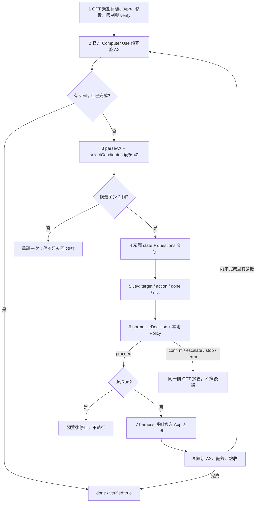

# Jev-cu v0.6.0 — GPT + ChatGPT 桌面版 Computer Use

v0.6.0 新增安裝時的本機金鑰設定與自動讀取，清楚區分網路拒絕與金鑰驗證；並修正 Windows 繁體中文控制項解析：保留原始元素編號與標籤、排除停用控制項，並將中文文字狀態納入 Jev 上下文。涵蓋小畫家實機觀察到的角色；不代表所有語系均已支援。

v0.5.0 新增目前 Windows 官方 `@oai/sky` 介面：精確選取單一視窗、直接讀取官方文字樹、依原有 Jev 四問與 Policy 提出一步，再由 GPT 在下一次工具呼叫執行並驗收。`runChatGPTTask({ sky, ... })` 預設只預覽；`dryRun:false` 回傳 `awaiting_review`，檢視後以 `executeWindowsStep(proposal)` 執行一次。使用範例見 [runtime.md](skill/jev-use/references/runtime.md)。原 `cua` 入口保留。

本版依「macOS 原版 Harness 校正版」恢復四問流程，**GPT 是唯一主 Agent，桌面操作只使用 ChatGPT 桌面版官方 Computer Use**。不啟動 Pi、AGY、OpenCode，不使用自製 Windows UIA/SendInput、Python 桌面工具、瀏覽器 bridge 或另一個執行代理。

Jev 保留圖中的 `target / action / done / risk` 四問：它選候選元素與動作類型；GPT 提供目標、參數、限制與驗收。本地 harness 在 GPT 啟動的官方工具 runtime 內執行有界迴圈。**這不是後來的 ALLOW/DENY reviewer；`done >= 0.9` 不等於 `approve >= 0.9`。**

## 八步流程



精簡限制保留：上下文 1500 字元、每個候選描述 120 字元；預設 dryRun=true。舊 cua 迴圈最多30步、最近6筆歷史。Windows 依官方文件分兩次工具呼叫，每次只準備／執行1步，GPT 以 plan/constraints 帶入必要進度。門檻保留原 policy：risk >= 0.2 要確認、target confidence 一般 0.5／指定低風險 App 0.4、低於 0.3 停止。App 白名單不是對所有動作的授權。

## 設定

1. 在 ChatGPT 桌面版使用 GPT，進入 ChatGPT Work，安裝／啟用官方 Computer Use 的 server 與 skill，依官方流程授權目標 App。
2. 將本 repository 作為本機專案資料夾開啟。Node.js 22+；沒有其他 npm 依賴。
3. 將根目錄 [`.env.example`](.env.example) 複製成 `.env.local`，在 `.env.local` 的 `OPENROUTER_API_KEY=` 後填入金鑰。`.env.example` 是會上傳 GitHub 的空白模板，真實金鑰只填入已排除 Git 追蹤的 `.env.local`。這是 **Jev** 的金鑰，不是用 API 取代桌面版 GPT。

```powershell
# 已在本專案 main 分支時
git pull --ff-only origin main
npm test
npm run doctor
npm run install-skill -- --force
```

安裝器複製 Skill 到 `~/.agents/skills/jev-use`，先備份到 `~/.agents/skill-backups`；並將專案 `.env.local` 的單一 `OPENROUTER_API_KEY` 匯入 `~/.agents/jev-cu/.env`。Windows 路徑是 `%USERPROFILE%\.agents\jev-cu\.env`。Skill 只記錄設定檔路徑，不含金鑰；執行程式會自行讀取，不需要將金鑰載入對話。設定檔位於專案和 Skill 備份之外；Unix 新檔案使用 0600，Windows 使用父資料夾的存取權限。這不會修改宿主權限、MCP 設定或安裝官方插件。

沒有專案金鑰時，安裝器會建立空白的本機設定檔並回報 `configured:false`，可直接填寫該檔案。已有本機設定預設保留，`--force` 也不覆寫金鑰；要從更新後的專案 `.env.local` 換入新金鑰，執行 `npm run install-skill -- --force --update-key`。移除 Skill 時保留設定檔。讀取順序為環境變數 → 專案 `.env.local` → 本機設定；更新金鑰時請留意較高優先序的舊值。

若偵測到舊 `~/.codex/skills/jev-use`，會回報但不擅自刪除。若目前桌面會話不顯示本機 Skill，直接在本機專案要求 GPT 讀取 `AGENTS.md` 與 `skill/jev-use/SKILL.md`。

```dotenv
OPENROUTER_API_KEY=your_openrouter_api_key
```

Jev 預設仍是 `typesafe/jev-1.13` / `https://openrouter.ai/api/alpha/decisions`。核心 `scripts/jev-decide.mjs` 和四問／Policy 保留；主要入口不接受替換 driver、模型或降門檻參數。

## 給 GPT 的啟動指令

> 讀取本專案 AGENTS.md 和 skill/jev-use/SKILL.md。你是唯一主 Agent，只使用這個 ChatGPT 桌面工作階段的官方 Computer Use。按八步四問 harness 執行：你規劃並提供參數，Jev 選 target/action 並回 done/risk，本地 Policy 判斷，再由官方 Computer Use 執行和讀取結果。先核對當前官方工具文件與授權、先 dry-run；缺少元件或介面不相容就停止／交回你判讀，不使用任何其他桌面驅動、代理或瀏覽器 bridge。

具體 runtime 範例在 [runtime.md](skill/jev-use/references/runtime.md)。`npm run doctor` 只做本機配置檢查，**無法在一般終端建立或確認桌面版官方 Computer Use runtime**。沒有 `npm start` 桌面伺服器，也不要求另開 Codex CLI。

## 平台及介面界線

官方說明目前支援 macOS 與 Windows 的 ChatGPT 桌面 Computer Use；兩平台介面不同。本版支援原 `cua.getApp()` / App.`getAXState()` 與 Windows 官方 `sky.list_apps()` / `sky.get_window_state()`。Windows 不重新編號、不以截圖或 document_text 拼造候選；缺少 accessibility.tree 時交回 GPT。**仍須以當次官方工具文件確認介面及授權**，不偽造 AX 或回退自製驅動。

Windows 以 `appName` 精確匹配官方 app id 或 displayName，多視窗時指定官方回傳的 `windowId`；不會自動挑第一個或自動開 App。支持元素點擊、set_value、已確認焦點的 type_text 與明確按鍵。捲動需座標、拖曳及其他視覺操作交回 GPT；不以按鍵偷偷替代。提案綁定真實觀察、不可重播、兩分鐘後過期；人工／其他工具改變畫面後須重新準備。尚未通過驗收時回 `step_complete`，不能視為任務完成。

Windows 官方 Computer Use 需前景且目標 App 可見。macOS 按官方要求啟用 Screen Recording / Accessibility。工具的實際方法、支援動作和安全規則以當次官方插件文件優先；本專案不自建、模仿或替換該插件。

圖中的 AX-only 主線沒有內建「AX 不足就看圖找按鈕」自動 fallback。只有 CapCut 視窗、沒有候選時，交回同一 GPT，用官方 Computer Use 的實際截圖／工具處理；不能編造按鈕 ID、把 done 當 approve，或降低門檻硬過關。座標操作由 GPT 透過官方工具另行處理，本入口不允許 `resources.at` 覆蓋文字候選的目標。

## 從 v0.3.0 遷移

已從本分支移除 `windows/`、所有 `windows:*` npm 指令及自動匯入 Windows companion 的 workflow。只更新 **Jev-cu**，Jev-ocu 不在本次修改範圍。歷史版本仍可由 Git history 找回。

本機舊 MCP 設定不會被 git pull 自動更改：請停用之前的自製 `jev-windows` server 與其 Skill，避免它繼續被載入；**保留官方 Computer Use 插件**。不要再套用舊的 Windows v1.1.0 修正包到本版。本專案不代為修改宿主設定或你的其他專案。

## 測試與限制

實機檢查（2026-09-20）：Windows 繁體中文小畫家可啟動並讀取控制項；修正前候選不足，修正後可以產生候選。這次官方 runtime 對 OpenRouter 連線回報 `EACCES`，尚未完成 Jev 真實決策與操作的端到端驗收。金鑰存在不表示連線或金鑰有效。遇到這類錯誤應停止該決策步驟，交回 GPT 說明限制；不得改用其他網路通道繞過宿主限制。

`npm test` 只跑離線測試：原四問／Policy／迴圈、官方 runtime adapter mock、GPT 入口完整流程 mock、安裝備份。它不操作真實桌面、不呼叫付費模型；跨平台 CI 通過也不表示真實 ChatGPT Work、CapCut 或每個 OS 的 runtime 已端到端驗收。

`npm run p0 -- --limit 1` 仍是舊 AX 快照的**付費** Jev 選元素評測，不控制桌面、不是實際任務成功率。`runs/*.jsonl` 可能包含任務和決策內容，勿公開私人資料；URL 清理不是完整去識別。

來源與版本對照：[docs/WORKFLOW.md](docs/WORKFLOW.md)、[docs/SOURCES.md](docs/SOURCES.md)。
